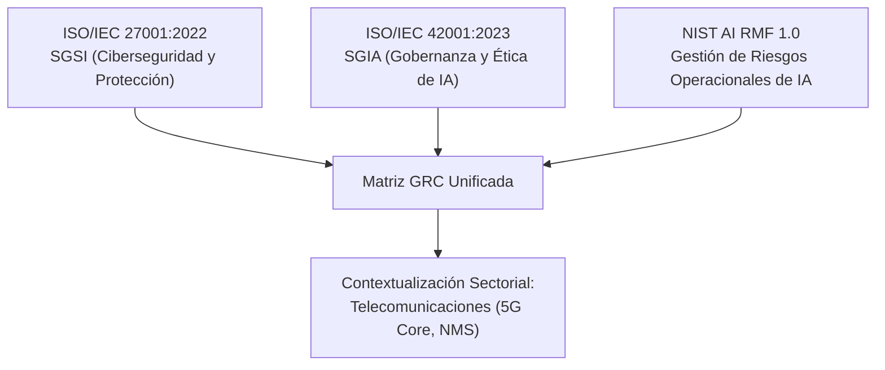

# Justificación Metodológica: Matriz de Cumplimiento Integrada GRC
## Seguridad de la Información, Gobernanza de IA y Gestión de Riesgos en Infraestructuras Críticas

Este documento detalla la **arquitectura metodológica**, los **marcos teóricos** y el **modelo de confluencia** desarrollados para dar sustento a la **Matriz de Cumplimiento Integrada GRC** (Governance, Risk, and Compliance) del sector de **Telecomunicaciones**.

---

## 1. El Problema Científico: Silos Normativos en Infraestructura Crítica
El despliegue de **Inteligencia Artificial (IA)** en entornos de **Infraestructura Crítica (IC)** —como las redes de telecomunicaciones core 5G/6G— introduce riesgos que los estándares de ciberseguridad tradicionales no pueden mitigar de forma aislada.

Tradicionalmente, las auditorías se ejecutan bajo esquemas de **silos normativos**:
*   El equipo de ciberseguridad audita **ISO/IEC 27001** (protección de datos e infraestructura).
*   El equipo de desarrollo de IA revisa el modelo frente a marcos éticos o **NIST AI RMF**.
*   El equipo de cumplimiento legal analiza la nueva norma **ISO/IEC 42001**.

Esto genera **redundancia operativa** (evaluar tres veces controles similares), **inconsistencia en métricas de madurez** y la **omisión de interdependencias de riesgo sistémico** (donde un fallo algorítmico en la IA puede comprometer la seguridad física del activo industrial).

---

## 2. La Solución: Modelo de Confluencia Normativa y Mapeo Decoplado
La **Matriz Integrada GRC** unifica estos tres estándares de referencia mundial en una única matriz multidimensional, desacoplada mediante un archivo maestro JSON (`mapping_normativo.json`).

### Los Tres Pilares del Modelo:

1.  **ISO/IEC 27001:2022 (SGSI)**: Aporta la base de seguridad de la información tradicional (confidencialidad, integridad, disponibilidad, controles de acceso, resiliencia y registros/logging).
2.  **ISO/IEC 42001:2023 (SGIA)**: Aporta el estándar de sistemas de gestión de IA, regulando el ciclo de vida del aprendizaje automático (ML), la explicabilidad algorítmica, y la transparencia hacia las partes interesadas.
3.  **NIST AI RMF 1.0**: Aporta un marco pragmático y de base técnica desarrollado por el gobierno de EE. UU. (Funciones: *Govern, Map, Measure, Manage*) diseñado para medir robustez adversarial, sesgo y desviaciones del modelo.

---

## 3. Modelo de Madurez: Normalización Cualitativo-a-Cuantitativa
Para superar la ambigüedad de los reportes cualitativos tradicionales, el sistema adopta una escala matemática fundamentada en el modelo **CMMI (Capability Maturity Model Integration)** y el estándar **ISO 27701 / ISO 15504 (SPICE)**.

Esta escala asocia un **estado cualitativo observable** con un **porcentaje preciso de implementación** y un **criterio técnico objetivo**:

| Nivel GRC | Estado Cualitativo | Porcentaje | Criterio de Madurez Técnico (Basado en Evidencia) |
| :--- | :--- | :---: | :--- |
| **0** | **Inexistente** | **0%** | Ausencia de cualquier proceso o control reconocible. La organización ignora el riesgo. |
| **1** | **Inicial** | **20%** | Hay evidencia de reconocimiento del riesgo. Las acciones son reactivas y dependen de esfuerzos individuales no documentados. |
| **2** | **Repetible** | **40%** | Los procesos siguen un patrón regular pero informal. Alta dependencia de personas clave. Falta comunicación y entrenamiento formal. |
| **3** | **Definido** | **60%** | Procesos formalmente documentados, comunicados y aprobados. Los controles son eficientes y se aplican sistemáticamente. |
| **4** | **Gestionado** | **80%** | Los procesos se monitorean, miden y evalúan de manera continua a través de métricas y KPIs cuantitativos de rendimiento. |
| **5** | **Optimizado** | **100%** | Automatización completa y mejora continua basada en datos. Los controles se adaptan dinámicamente ante nuevas amenazas. |

### Algoritmo de Cobertura por Dimensión:
El avance global y por dimensión no es una simple suma. Se calcula mediante una media ponderada:

$$\text{Cumplimiento de la Dimensión} = \frac{\sum_{i=1}^{N} \text{Calificación}(C_i)}{N \times 1.0}$$

Donde $\text{Calificación}(C_i) \in \{0.0, 0.2, 0.4, 0.6, 0.8, 1.0\}$ representa el valor numérico normalizado del control evaluado.

---

## 4. Arquitectura de Confluencia: Los 5 Controles Críticos en Telecomunicaciones
Para el caso práctico del **Sector de Telecomunicaciones**, se seleccionaron **5 controles transversales** que ejemplifican la confluencia entre ciberseguridad clásica, gobierno de IA y resiliencia de infraestructura:

### Control 1: Gobernanza y Liderazgo (`GOB-01`)
*   **ISO 27001 (5.1)**: Liderazgo y compromiso de la alta dirección.
*   **ISO 42001 (5.1)**: Liderazgo ético en sistemas de IA (transparencia y rendición de cuentas).
*   **NIST AI RMF (GOVERN 1.1)**: Establecimiento de políticas de gobernanza organizacionales para IA.
*   *Justificación Telecom*: En una red móvil core 5G, las decisiones sobre la optimización del tráfico de red (enrutamiento de datos de misión crítica) no pueden dejarse en manos de algoritmos "caja negra" sin la supervisión directa de un **Comité de Ética y Ciberseguridad de IA** y un **Oficial de IA (Chief AI Security Officer)** con poder de veto sobre despliegues inestables.

### Control 2: Mapeo y Gestión de Riesgos (`RIE-01`)
*   **ISO 27001 (6.1.2)**: Proceso de evaluación de riesgos de seguridad tradicionales.
*   **ISO 42001 (6.1.2)**: Evaluación de riesgos de IA (drift, sesgo algorítmico, robustez).
*   **NIST AI RMF (MAP 1.1-1.6)**: Mapeo detallado de impactos de IA para todas las partes interesadas.
*   *Justificación Telecom*: Los fallos en redes críticas tienen un **efecto dominó** (caída de sistemas de salud, transporte, servicios bancarios). La metodología unificada obliga a simular **IA adversarial** (ej. manipulación de tráfico mediante datos contaminados) y a documentar interdependencias de infraestructura.

### Control 3: Registro Inmutable y Trazabilidad (`TEC-02`)
*   **ISO 27001 (A.8.15)**: Gestión tradicional de registros y bitácoras (logs).
*   **ISO 42001 (A.6.2.6)**: Registro detallado de decisiones de los modelos de IA (entradas, pesos, parámetros y outputs).
*   **NIST AI RMF (GOVERN 4.1 + MEASURE 4.1)**: Trazabilidad completa para rendición de cuentas.
*   *Justificación Telecom*: Ante una caída masiva del servicio móvil provocada por un algoritmo predictivo, es indispensable contar con un **registro inmutable de telemetría y decisiones ML (WORM - Write Once, Read Many)** para realizar análisis foreneses post-incidente y dar explicabilidad al regulador del sector TIC.

### Control 4: Supervisión Humana y Override (`HUM-01`)
*   **ISO 27001 (A.5.1 / 7.2)**: Competencias y concientización del personal en seguridad.
*   **ISO 42001 (A.3)**: Definición de niveles de supervisión humana (HITL - Human-in-the-Loop).
*   **NIST AI RMF (GOVERN 3.1 + MAP 3.5)**: Mecanismos de intervención y override humana significativa.
*   *Justificación Telecom*: Los sistemas anti-DDoS inteligentes automatizados operan a milisegundos. Para evitar **falsos positivos** masivos que desconecten subestaciones o antenas de emergencia, la metodología exige un **bypass manual validado** y simulado trimestralmente por los operadores del NOC (Network Operations Center).

### Control 5: Resiliencia y Operación en Modo Degradado (`RES-01`)
*   **ISO 27001 (A.5.30)**: Preparación de la continuidad tecnológica.
*   **ISO 42001 (A.6.2.5)**: Continuidad operativa de los sistemas de IA.
*   **NIST AI RMF (MANAGE 4.1-4.2)**: Resiliencia de IA y Graceful Degradation.
*   *Justificación Telecom*: Si el enrutamiento predictivo por IA falla catastróficamente, el sistema crítico debe contar con redundancia física (N+1) y la capacidad de conmutar en menos de **15 minutos (RTO < 15m)** a un modo de enrutamiento estático tradicional (modo degradado manual) sin intervención de modelos de IA.

---

## 5. Utilidad y Valor Diferencial de la Herramienta
La herramienta unificada que hemos construido aporta tres ventajas clave fundamentales para una sustentación profesional:

1.  **Reducción del 60% del Tiempo de Auditoría**: Al unificar la recolección de evidencia, el auditor evalúa un único punto y la aplicación propaga y mapea el estado respectivo en los 3 marcos.
2.  **Reportabilidad Directiva (Dashboard GRC + Excel)**: Los gráficos interactivos y el reporte Excel exportado proporcionan a la alta dirección (y al profesorado evaluador) una vista ejecutiva instantánea y clara, alineada con las mejores prácticas corporativas del estándar `GAP.xlsx`.
3.  **Habilitación de Propuestas de IA Contextuales**: La base de conocimiento local (RAG) combinada con los porcentajes exactos de madurez del editor le permite a los LLMs generar hojas de ruta de implementación viables y realistas, convirtiendo la auditoría pasiva en una herramienta de ingeniería estratégica activa.
